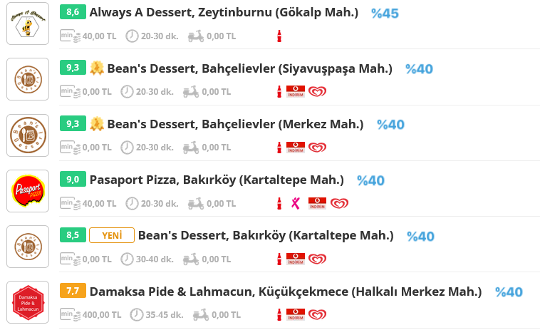

<style>
body {
text-align: justify}
</style>


```{r setup, echo=FALSE, include=FALSE}

require(tidyverse)
require(sf)
require(ggsci)
require(extrafont) 
require(plotly)
require(tweetrmd)
require(here)


```

## Humble beginnings

As with my major data analysis/science projects, this one has followed a course of growth over the last couple of years. As my approach changed, the product manifested itself in different and more detailed forms (for the better, I would say). But the main reason I am interested in food data is still the same. That is, well, that there are fundamental differences in how people from different backgrounds make eating decisions on a daily basis. After all, we are what we eat.

Or, is it the other way around?

I am not only talking about religion-driven or simple income-induced differences. Even eating can get political under particular conditions and certain edible items can and will be perceived as signals for association with a social group, as these signals usually become even more salient in polarized social settings [@dellaposta2015liberals]. As I continue exploring food industries in various locations (next up: Berlin), I took a detour to revisit Turkey's leading but increasingly infamous^[@duvarenglish_2021] food^[@duvarenglish_2022] delivery leviathan: yemeksepeti.com.

One and a half year ago, for a tweet of mine that became somewhat of a hit (which I linked just below), I had tapped into the aforementioned delivery service for the first time. Scraping the data off it was rather straight forward: crawling JavaScript based content was not strictly necessary unless you wanted to have access to restaurants that are not open for delivery at that time of the day. This required (and still does) activating a simple check-box that triggered a JavaScript event that listed the restaurants regardless of their state. I did not particularly like that there was a possibility that some restaurants didn't get picked up by the rvest script but I still went along with scraping the data during the peak hours because I did not actually have much free time then. Fast forward a couple days, I had curated a data set that featured the menus of a sizable portion of the restaurants in Istanbul that partnered up with yemeksepeti, and the list of neighborhoods these restaurants served.

Speaking of web-scraping, [here](https://github.com/baslare/ys2022) is the github repository for this most recent version of the project. I will try to make available all my projects unless I suspect that there might be possible terms of service violations with publicizing the codes and/or data. Whatever, back to the task at hand: This time around, I used Selenium in python to collect the links to each restaurant and rvest in R to collect the menus.

Alright, back to September 2020. if you are interested - which you probably are, if you are here reading this post -, just take a look at the tweet. The main idea is that there are considerable differences in average Lahmacun prices (a popular dough, spice and meat based food, sometimes referred to as the "Turkish Pizza", woefully) across different districts in Istanbul. Naturally, the richer and the more attractive is the district, the higher are the prices... ostensibly. But is it that simple? There are numerous deviations from what you would expect based on that intuition and we might want to investigate this further. So, one of my motivations was to improve the script and delve further into the dynamics that surround the pricing of Lahmacun and other practical foods.


```{r tweet, echo=FALSE, fig.cap="Lahmacun prices across Istanbul districts in September 2020"}

tweet_embed("https://twitter.com/baslare/status/1302674859965718528")

#tweet_screenshot(tweet_url = "https://twitter.com/baslare/status/1302674859965718528",theme="dark")

```

In addition to my usual rationale for getting my hands dirty around the inspect functionality of my Firefox browser, I had to satiate my curiosity in one additional aspect. If you are keeping track of the news then you might possibly have heard of inflation soaring high^[@osterlund_2022] in Turkey and if you are a little perceptive, you might also have noticed that the official figures for annual inflation^[@darenbutler_2022] are met with stark suspicion^[@duvar_english_2021_b], well, for a plethora of reasons. So, for taking a peek at what "true" inflation looks like, there isn't a much better way than utilizing a service that Istanbulites have come to rely upon even more heavily in the Covid-19 world. Alright, without further ado, let us move on to the punchline.


## The Punchline

```{r plot1, message = FALSE, echo = FALSE, warning=FALSE, fig.width=12, fig.height=8, fig.cap="Average lahmacun prices in each Istanbul district: Use the plotly controls on the upper right corner to navigate the plot!",cache=FALSE,}


source("C:/Users/Efe/Desktop/Projeler/ys2022/ys2022/ys_functions.R")


#all_list <- jsonlite::fromJSON("C:/Users/Efe/Desktop/Projeler/ys2022_files/ys_all_list.json")
ys_restdist_df <- jsonlite::fromJSON("C:/Users/Efe/Desktop/Projeler/ys2022_files/ys_restdist_df.json")
#ys_restdist <-  jsonlite::fromJSON("C:/Users/Efe/Desktop/Projeler/ys2022_files/ys_restdist.json")
#ys_url <- jsonlite::fromJSON("C:/Users/Efe/Desktop/Projeler/ys2022_files/ys_disturl.json")
df_master <- readRDS("C:/Users/Efe/Desktop/Projeler/ys2022_files/df_master.RDS")
ibb23haz <- read.csv("C:/Users/Efe/Desktop/Projeler/esmt_flash/ibb23Haz/ibb23Haz/ibb23Haz.csv",encoding = "UTF-8")
dnm <- read.csv("C:/Users/Efe/Desktop/Projeler/ys2022_files/dnm.csv",header = FALSE)
ist_mah_demo_df <- readRDS("C:/Users/Efe/Desktop/Projeler/ys2022_files/ist_mah_demo_df.rds")
ist_ilce_demo_df <- readRDS("C:/Users/Efe/Desktop/Projeler/ys2022_files/ist_ilce_demo_df.rds")

#all_list: contains the menus of each restaurant, df_master is the df form
#ys_restdist: contains the name,url,rating of the restaurants that make deliveries to each district in list format
#ys_restdist_df: contains the name,url,rating of the restaurants that make deliveries to each district (contains duplicate restaurants)
#ys_url: urls of each restaurant (unique key)
#df_master: all items in restaurant menus in a single df


  
  product_name <- "Lahmacun"
  
  if(product_name=="Lahmacun"){
    df_sub <- df_master %>% 
      filter(str_detect(products,product_name)) %>% 
      filter(!str_detect(products,"Menü|[0-9]+|Kebap|Dürüm|Döner|Aras.|Pizza|Duble|Pide")) %>% 
      filter(!str_detect(products,"F.nd.k"))
    text.color = "#8a1a04"
    sci.palette = "yellow"
  }else if(product_name=="Burger"){
    
    df_sub <- df_master %>% 
      filter(str_detect(products, product_name)) %>% 
      filter(!str_detect(products,"Mini|Falafel|Ekme.i|sos|Süt|Domatex|Sosu$|Sos$|Baharat|Mayone.|Ket.ap|Islak|Menü|[0-9]+|Kebap|Dürüm|Döner|Aras.|Pizza|Duble|Pide")) %>% 
      filter(!str_detect(products,"F.nd.k"))
    text.color = "#0f1852"
    sci.palette = "blue"
  }else if(product_name=="Döner"){
    
    df_sub <- df_master %>% 
      filter(str_detect(products, product_name)) %>% 
      filter(!str_detect(products,"Tavuk|Beyti|Mini|Falafel|Ekme.i|sos|Süt|Domatex|Sosu$|Sos$|Baharat|Mayone.|Ket.ap|Islak|Menü|[0-9]+|Pizza|Duble|Pide|.skender|Double|Burger|Pilav|Kebap|X")) %>% 
      filter(!str_detect(products,"F.nd.k"))
    text.color = "#4f021b"
    sci.palette = "pink"
  }else if(product_name=="Tavuk Döner"){
    df_sub <- df_master %>% 
      filter(str_detect(products, "Döner")) %>% 
      filter(!str_detect(products,"Et|Beyti|Mini|Falafel|Ekme.i|sos|Süt|Domatex|Sosu$|Sos$|Baharat|Mayone.|Ket.ap|Islak|Menü|[0-9]+|Pizza|Duble|Pide|.skender|Double|Burger|Pilav|Kebap|X")) %>% 
      filter(!str_detect(products,"F.nd.k"))
    text.color = "#0f1852"
    sci.palette = "blue"
  }
 
  #store the rating/min delivery price/min delivery time in a df for each *unique* restaurant
  ys_restdist_df_unique <- ys_restdist_df %>% distinct(rest_url,.keep_all = T) %>% select(-district)
  
  
  #calculate the averages in each restaurant for the desired group  
  rest_product_averages <- df_sub %>% group_by(rest_name) %>% summarise(av_price=mean(prices))
  #alternative statistics
  #rest_product_median <- df_sub %>% group_by(rest_name) %>% summarise(av_price=median(prices))
  #rest_product_min <- df_sub %>% group_by(rest_name) %>% summarise(av_price=min(prices))
  #rest_product_max <- df_sub %>% group_by(rest_name) %>% summarise(av_price=max(prices))
  
  
  #merge the product averages for each restaurant df with other restaurant statistics
  
  ys_restdist_df$min_package_tl <- ys_restdist_df$min_package_tl %>% scales::squish(range = c(10,max(ys_restdist_df$min_package_tl)))
  
  
  dist_product_averages <- left_join(ys_restdist_df,rest_product_averages,by=c("rest_url"="rest_name"))
  dist_product_averages <- dist_product_averages %>% drop_na()
  
  
  rest_data_unique <- dist_product_averages %>% distinct(rest_url,.keep_all = T)
  
  
  
  dist_product_averages <- dist_product_averages %>% group_by(district) %>% mutate(weighted_md_amount = (1/(min_package_tl))/sum(1/(min_package_tl)),
                                                                             weighted_md_time = 1/(min_delivery_time)/sum(1/(min_delivery_time)) ,
                                                                             weighted_both = 1/((min_package_tl*min_delivery_time))/sum(1/((min_package_tl*min_delivery_time)))) %>% 
    ungroup()
  
  dist_product_averages <- dist_product_averages %>% group_by(district) %>% summarise(av_price_amount =sum(weighted_md_amount*av_price),
                                                                                      av_price_time = sum(weighted_md_time*av_price),
                                                                                      av_price_both = sum(weighted_both*av_price),
                                                                                      av_price=mean(av_price),
                                                                                      count = n(),
                                                                                      weighted_rating = sum(weighted_both*rating))
                                                                                      
                                                                                      
  dist_product_averages$district_name <- dist_product_averages$district %>% str_split("/")
  dist_product_averages$district_name <- sapply(dist_product_averages$district_name, function(x) x[[3]])
  dist_product_averages$district_name <- dist_product_averages$district_name %>% str_split("-",n = 2)   
  
  dist_product_averages$distr_name <- sapply(dist_product_averages$district_name, function(x) x[[1]])                                       
  dist_product_averages$distr_name <- dist_product_averages$distr_name %>% str_replace("macka","sisli")
  dist_product_averages$distr_name <- dist_product_averages$distr_name %>% str_replace("buyukada|kinaliada|burgazada","adalar")
  dist_product_averages$distr_name <- dist_product_averages$distr_name %>% str_replace("eyup","eyupsultan")
  
  
  
  dist_product_averages$district_name <- sapply(dist_product_averages$district_name,function(x){
    if(length(x) > 1){
      x[[2]]
    }else{
      x[[1]]
    }
  })
  
  
  
  
  ilce_average <- dist_product_averages %>%
    group_by(distr_name) %>% 
    summarise(av_price=sum(av_price_amount*count/(sum(count))),
                           av_price_uw=mean(av_price_amount),
                           av_rating=sum(weighted_rating*count/(sum(count))),
              count=mean(count))
  
  
  ilce_map <- read_sf("C:/Users/Efe/Desktop/Projeler/ys2022/shapefiles/ist_ilce.shp")
  ilce_map$no_tr = ilce_map$name %>% stringi::stri_trans_general("latin-ascii")
  ilce_map$no_tr <- ilce_map$no_tr %>% tolower()
  ilce_map <- ilce_map %>% select(no_tr,name,geometry)
  
  #ist_ilce_demo_df <- get_ist_demo()
  
  
  ilce_map <- left_join(ilce_map,ist_ilce_demo_df,by="no_tr")
  
  final_df <- left_join(ilce_map,ilce_average,by=c("no_tr"="distr_name"))
  final_df$dist_area <- (sf::st_area(final_df)/1000000) %>% as.character() %>%  as.numeric() %>% scales::squish(c(35,200))
  
  istbbx <- c(28.3025,	40.7933,	29.5223,	41.3812)
  
  final_df <- final_df %>% st_crop( xmin = istbbx[1], xmax = istbbx[3],
                                    ymin = istbbx[2], ymax = istbbx[4])
  
  
  
  final_df <- final_df %>% mutate(uni_grad_share = 0.01*universiteOran)
  final_df <- final_df %>% rename(population = ikiBin19Nufus,rest_count = count)

  final_df <- final_df %>% st_cast("MULTIPOLYGON")
  final_df <- final_df %>% mutate(price_text=as.character(round(av_price,digits=1)))
  
  
  
  lakes <- read_sf("C:/Users/Efe/Desktop/Projeler/ys2022/shapefiles/goller.shp")
  lakes <- lakes %>% filter(type == "multipolygon")
  lakes <- lakes %>% st_cast("MULTIPOLYGON")
  
  
  quant_10 <- final_df$av_price %>% quantile(0.1,na.rm = T)
  quant_90 <- final_df$av_price %>% quantile(0.9,na.rm = T)
  
  
  plot_1 <- ggplot(final_df) + 
    geom_sf(aes(fill=av_price),color="white",show.legend = FALSE,size=0.2) + 
    geom_sf(data=lakes,color="transparent",fill="white") +
    geom_sf_text(aes(label=price_text,
                     size= 2 + log(10 + dist_area),group=name),
                 color=text.color,
                 show.legend = FALSE,
                 family="Noto Sans") + 
    scale_fill_material(sci.palette,oob=scales::squish,limits=c(quant_10,quant_90)) +  #15,20 for the lahmacun map
    scale_size(range = c(2.5,5)) +
    theme_bw() +
    theme(axis.line = element_blank(),
          axis.ticks = element_blank(),
          axis.text = element_blank(),
          panel.grid = element_blank(),
          panel.background = element_blank(),
          axis.title = element_blank(),
          text = element_text(color=text.color,family = "Noto Sans"),
          panel.border = element_rect(color="gray",size=0.3),
          plot.title = element_text(hjust = 0.5,size = 10),
          plot.caption = element_text(size=8),
          plot.subtitle = element_text(hjust = 0.5,size = 8),
    ) +
    scale_x_continuous(limits = c(istbbx[1],istbbx[3])) +
    scale_y_continuous(limits=c(istbbx[2],istbbx[4])) +
    ggtitle(label = paste("Average", product_name ,"Prices \n in Istanbul Districts(TL)"),subtitle = 'February 2022') + labs(caption = "Efe Başlar - @baslare")
  
  #interactive
  plotly::ggplotly(plot_1,tooltip = "name")


```

OK. Take a look at the map above. Move your mouse cursor over the districts for more information, if you'd like. Take a look at the previous iteration of the same map. Yup. It is correct. **The prices have increased around 100%** and that happened within a span of 18 months. Let that sink in. And no, I have not changed my methodology greatly, barring some improvements for more accurate estimation. I'll be detailing these improvements below but overall it is pretty similar to one I had then. Overall, inflation seem to be running rampart in the food industry and the prices seem to have inflated *equally* across districts: around a whopping 100%! The figures are based on 2198 yemeksepeti partner restaurants with Lahmacun on their menu (those that satisfy some qualifications I laid out below).

The districts with a sizable secular, upper-middle class residents (read: economically better off) seem to be the ones in which you can have the most pricey lahmacuns. But the number of restaurants serving in each district is not necessarily proportional to the population residing within that district. It shouldn't come as a surprise when I tell youthat it is mostly the younger inhabitants, especially university students that use food delivery services.

### In need of a representative statistic

Now, let us dive into some details about how this plot was created. Creating the plots was definitely not as straightforward as the maps themselves seem. I mentioned just above that I had made some improvements in my approach. Improvements seldom come without any further complexity and this is one of those cases (not always, of course).

yemeksepeti lists 961 precinct equivalent divisions for its partner network in Istanbul. This is deceptively similar to the true number of precincts in Istanbul, which stands at 964. However, some precincts are arbitrarily divided by yemeksepeti for operational reasons, as precincts are hardly homogeneous across different districts in Istanbul and not necessarily equally reachable: they range from a few hundred of inhabitants to a hundred thousand. 

Precincts constitute the smallest possible Turkish administrative unit, as per the latest regulations. Districts, depicted on the maps in this post, house a number of districts. Basic math tells us that for each of the 39 districts in Istanbul we can expect to observe around 25 precincts. The way yemeksepeti stores its data doesn't tell much about where a restaurant is located. It would have been amazing to be able to have access to geolocation data but a web-scraper must live with what he can get his hands on. 

Even knowing about the precise locations of each restaurant would not be able to change a simple fact: restaurant deliveries are trans-precinct and most of the time trans-district. Each precinct is (*literally*) fed by a number of restaurants located in an around itself and some precincts are served by more restaurants than other precincts. Even though I was aware of this simple fact when I first delved into yemeksepeti data, I had only taken a simple average for each district, without giving any effort to create a more representative statistic under this particular structure of the data.

```{r, echo = FALSE, fig.align = 'center',fig.width=10, fig.height=12, fig.cap="A sample listing of restaurants, the restaurant at the bottom is around 15 kilometers away from the focal precinct and has a huge minimum delivery amount for a lahmacun bakery."} 

```

In addition, programmatically searching each restaurant's menu for the product of interest ("Lahmacun", in this particular case), has its own problems. If your goal is to filter everything with "Lahmacun" in its name, then you are in for a treat because you are going to get every form of seemingly relevant item in the results. The solution is to include some keywords or other elements you do not want to see. Since I wanted to focus as much as possible to the single, I employed that solution. You can refer to my github repository if you are interested in how I filtered out the "lahmacuns of interest".

Furthermore, most of the partner restaurants have set a minimum threshold on the total amount of the order in TL, conditional on the precinct they serve. The customer therefore must surpass that threshold in order to guarantee a delivery for the order. Although I sincerely doubt that these values are issued with any meticulous calculation, the underlying rationale probably draws from a simple and rational mechanism: cost-benefit trade-off. 

If a restaurant sets too high a threshold, then it could mean that they regard that particular customer to be to far away and that it is not worth it to send out a rider for that delivery or that the restaurant is too fancy for a small delivery. There are some ridiculous combinations, e.g. a Lahmacun restaurant requiring a minimum 1000 TL delivery amount for some precincts (Since you have studied the map above you know you would need to order around 50 Lahmacuns on average to qualify for such delivery), or a fancy restaurant offering its *gourmet* Lahmacun for around 90 TL. 

It is obvious that a person looking for a *regular* Lahmacun would hardly consider those kind of restaurants to be among viable alternatives for his lovely lahmacun-to-be. But, in theory, that particular restaurant is still part of the restaurants that serve that specific precinct and should somehow be incorporated into the statistic. My solution is to apply a weighted average based on this delivery threshold (you can see a sample of restaurants with different thresholds in the screenshot above). 

Let $p_i$ denote the weighted average of the restaurants serving the precinct $i$, $t_{ij}$ is the threshold associated with restaurant $i$ serving to the precinct $j$ and $p_{j}$ corresponds to the price of a product at restaurant $j$, to my knowledge the restaurants do not engage in variable pricing, therefore the prices are invariant to $i$. Yes, the prices in each restaurant are weighted by the inverse of the threshold $t_{ij}$. You can notice that some restaurants have a threshold of 0, so I just replaced those values with 10. In addition, because the number that serve each precinct can differ, it is worthwhile to keep the number of restaurants serving each precinct. I used the restaurant counts as weights for each precinct when calculating the weighted average for each district.


$$p_i = \sum_{j \in J}\frac{p_{j}/t_{ij}}{\sum_{j \in J} 1/t_{ij}}$$


Assuming that everything went according to the plan, we get a list of all the precinct-equivalent units at yemeksepeti, with all the desired statistics. Thankfully, within the URL to each of the precinct-equivalent units we have the name of the district it belongs to. This gives us, with some [regular expressions](https://regexr.com/) workaround, the possibility of extracting the names of each Istanbul district. After doing all the processing, we get a list of the 39 districts and the corresponding  weighted-average lahmacun prices. Yep. That was that simple.

Next up, even though I cannot provide any benchmark for the severity of the consumer inflation of other food items, you can find below maps and charts for Hamburgers and Beef/Chicken Döners. In the section that follows, I'll a bit about a couple of regression models to dig deeper into precinct-based, rather than district based analyses.


```{r, echo=FALSE,results="asis"}

#final_df <- ys_processed[[2]]

nb_product_averages <- dist_product_averages
nb_product_averages$district_name <- nb_product_averages$district_name %>% str_remove("ilcesi")
nb_product_averages$district_name <- nb_product_averages$district_name %>% str_replace_all("-"," ") %>% str_trim() 
nb_product_averages$district_name <- nb_product_averages$district_name %>% str_remove("mah$")
nb_product_averages$district_name <- nb_product_averages$district_name %>% str_trim()
nb_product_averages$district_name <- nb_product_averages$district_name %>% str_remove(" mah(.)+")
nb_product_averages$district_name <- nb_product_averages$district_name %>% str_replace("(?<=([0-9]))\\s",". ")
nb_product_averages$district_name <- ifelse(nb_product_averages$district_name %>% str_detect("atakent"),"atakent",nb_product_averages$district_name)

#dnm <- left_join(dist_product_averages, ist_mah_demo_df, by=c("district_name"="no_tr_mah","distr_name"="no_tr"))
#write.csv(dnm,"dnm.csv")


dnm <- dnm %>% select(V2,V9)
dnm$V9 <- dnm$V9 %>% tolower() %>%  str_trim()

nb_product_averages <- left_join(nb_product_averages,dnm,by=c("district"="V2"))
nb_product_averages$V9 <- nb_product_averages$V9 %>% str_replace("catalcesme","catalmese")


colnam <- colnames(nb_product_averages)[which(sapply(nb_product_averages,is.numeric))]

nb_product_averages <- nb_product_averages %>% group_by(distr_name,V9) %>% summarise_at(.vars = colnam,.funs = mean)

nb_product_averages <- left_join(nb_product_averages, ist_mah_demo_df, by=c("V9"="no_tr_mah","distr_name"="no_tr"))     
nb_product_averages <- nb_product_averages %>% drop_na()

nb_product_averages  <-nb_product_averages  %>% mutate(uni_grad_share = 0.01*universiteOran)
nb_product_averages  <- nb_product_averages  %>% rename(pop_density = nufusYogunluk, pop = ikiBin19Nufus, rest_count = count)


ibb23haz$no_tr <- ibb23haz$district %>% stringi::stri_trans_general("latin-ascii") %>% tolower()
ibb23haz$no_tr_mah <- ibb23haz$precinct %>% stringi::stri_trans_general("latin-ascii") %>% tolower()


colnam_ibb <- colnames(ibb23haz)[which(sapply(ibb23haz,is.numeric))]
ibb23haz <- ibb23haz %>% group_by(no_tr,no_tr_mah) %>% summarise_at(.vars = colnam_ibb,.funs = sum)
ibb23haz$no_tr_mah <- ibb23haz$no_tr_mah %>% str_remove("mah[.]$") %>% str_trim()
ibb23haz$no_tr_mah <- ibb23haz$no_tr_mah %>% str_replace("merkez ataturk","ataturk")


full_df <- left_join(nb_product_averages,ibb23haz,by=c("V9"="no_tr_mah","distr_name"="no_tr"))
full_df <- full_df %>% mutate(akp_share = akp_06/voter_06,
                              chp_share = chp_06/voter_06,
                              youth_diff = youth_male_share - youth_female_share,
                              akp_chp_diff = akp_share - chp_share
)


full_df <- full_df %>% filter(pop > 500)
dd <- lm(av_price_amount ~ youth_diff + log(pop) + weighted_rating + akp_chp_diff  + rest_count,data=full_df)


```

While you are still here take a look at the histogram below of Lahmacun restaurant prices in the entire data set. The average price is around 16.30 TL, which is slightly over 1 euro. 

```{r,echo=FALSE,fig.cap="Histogram of average restaurant prices for lahmacun"}
plot_hist <- ggplot(rest_product_averages) + 
  geom_histogram(aes(av_price),bins = 60,fill="#d6c033",alpha=0.5)+
  geom_vline(aes(xintercept=mean(av_price)),linetype="dotted",size=1,color="#8a1a04") +
  labs(x=paste("Average Restaurant",product_name,"Price"),y="Restaurant Count") +
  scale_x_continuous(breaks = seq(10,80,10)) +
  theme(panel.grid.minor = element_blank(),
        panel.background = element_rect(fill="#faf5ed"),
        text = element_text(family = "Noto Sans"))

plotly::ggplotly(plot_hist)
```


## Moving Beyond Lahmacun

I'll refrain from engaging in commenting in detail too much on the plots below as they follow the same principles I laid out above and I believe they can speak for themselves. These may not make much sense without a benchmark, but the price patterns observed for Lahmacun seem to persist across other deliverable food. The table below summarizes the number of restaurants that I used for calculation of the weighted average prices. 

```{r, echo=FALSE, results="asis",}

kableExtra::kable(data.frame(Product=c("Lahmacun","Burger","Döner","Tavuk Döner"),n=c(2198,2799,1805,1569)),caption = "The number of restaurants offering each product") %>% kableExtra::kable_styling(position = "center")
```


```{r, message = FALSE, echo = FALSE, warning=FALSE, fig.width=12, fig.height=8, fig.cap="Average Burger prices in each Istanbul district: Use the plotly controls on the upper right corner to navigate the plot!",cache=FALSE}


  product_name <- "Burger"
  
  if(product_name=="Lahmacun"){
    df_sub <- df_master %>% 
      filter(str_detect(products,product_name)) %>% 
      filter(!str_detect(products,"Menü|[0-9]+|Kebap|Dürüm|Döner|Aras.|Pizza|Duble|Pide")) %>% 
      filter(!str_detect(products,"F.nd.k"))
    text.color = "#8a1a04"
    sci.palette = "yellow"
  }else if(product_name=="Burger"){
    
    df_sub <- df_master %>% 
      filter(str_detect(products, product_name)) %>% 
      filter(!str_detect(products,"Mini|Falafel|Ekme.i|sos|Süt|Domatex|Sosu$|Sos$|Baharat|Mayone.|Ket.ap|Islak|Menü|[0-9]+|Kebap|Dürüm|Döner|Aras.|Pizza|Duble|Pide")) %>% 
      filter(!str_detect(products,"F.nd.k"))
    text.color = "#0f1852"
    sci.palette = "blue"
  }else if(product_name=="Döner"){
    
    df_sub <- df_master %>% 
      filter(str_detect(products, product_name)) %>% 
      filter(!str_detect(products,"Tavuk|Beyti|Mini|Falafel|Ekme.i|sos|Süt|Domatex|Sosu$|Sos$|Baharat|Mayone.|Ket.ap|Islak|Menü|[0-9]+|Pizza|Duble|Pide|.skender|Double|Burger|Pilav|Kebap|X")) %>% 
      filter(!str_detect(products,"F.nd.k"))
    text.color = "#8a1a04"
    sci.palette = "yellow"
  }else if(product_name=="Tavuk Döner"){
    df_sub <- df_master %>% 
      filter(str_detect(products, "Döner")) %>% 
      filter(!str_detect(products,"Et|Beyti|Mini|Falafel|Ekme.i|sos|Süt|Domatex|Sosu$|Sos$|Baharat|Mayone.|Ket.ap|Islak|Menü|[0-9]+|Pizza|Duble|Pide|.skender|Double|Burger|Pilav|Kebap|X")) %>% 
      filter(!str_detect(products,"F.nd.k"))
    text.color = "#0f1852"
    sci.palette = "blue"
  }
 
  #store the rating/min delivery price/min delivery time in a df for each *unique* restaurant
  ys_restdist_df_unique <- ys_restdist_df %>% distinct(rest_url,.keep_all = T) %>% select(-district)
  
  
  #calculate the averages in each restaurant for the desired group  
  rest_product_averages <- df_sub %>% group_by(rest_name) %>% summarise(av_price=mean(prices))
  #alternative statistics
  #rest_product_median <- df_sub %>% group_by(rest_name) %>% summarise(av_price=median(prices))
  #rest_product_min <- df_sub %>% group_by(rest_name) %>% summarise(av_price=min(prices))
  #rest_product_max <- df_sub %>% group_by(rest_name) %>% summarise(av_price=max(prices))
  
  
  #merge the product averages for each restaurant df with other restaurant statistics
  
  ys_restdist_df$min_package_tl <- ys_restdist_df$min_package_tl %>% scales::squish(range = c(10,max(ys_restdist_df$min_package_tl)))
  
  
  dist_product_averages <- left_join(ys_restdist_df,rest_product_averages,by=c("rest_url"="rest_name"))
  dist_product_averages <- dist_product_averages %>% drop_na()
  
  
  rest_data_unique <- dist_product_averages %>% distinct(rest_url,.keep_all = T)
  
  
  
  dist_product_averages <- dist_product_averages %>% group_by(district) %>% mutate(weighted_md_amount = (1/(min_package_tl))/sum(1/(min_package_tl)),
                                                                             weighted_md_time = 1/(min_delivery_time)/sum(1/(min_delivery_time)) ,
                                                                             weighted_both = 1/((min_package_tl*min_delivery_time))/sum(1/((min_package_tl*min_delivery_time)))) %>% 
    ungroup()
  
  dist_product_averages <- dist_product_averages %>% group_by(district) %>% summarise(av_price_amount =sum(weighted_md_amount*av_price),
                                                                                      av_price_time = sum(weighted_md_time*av_price),
                                                                                      av_price_both = sum(weighted_both*av_price),
                                                                                      av_price=mean(av_price),
                                                                                      count = n(),
                                                                                      weighted_rating = sum(weighted_both*rating))
                                                                                      
                                                                                      
  dist_product_averages$district_name <- dist_product_averages$district %>% str_split("/")
  dist_product_averages$district_name <- sapply(dist_product_averages$district_name, function(x) x[[3]])
  dist_product_averages$district_name <- dist_product_averages$district_name %>% str_split("-",n = 2)   
  
  dist_product_averages$distr_name <- sapply(dist_product_averages$district_name, function(x) x[[1]])                                       
  dist_product_averages$distr_name <- dist_product_averages$distr_name %>% str_replace("macka","sisli")
  dist_product_averages$distr_name <- dist_product_averages$distr_name %>% str_replace("buyukada|kinaliada|burgazada","adalar")
  dist_product_averages$distr_name <- dist_product_averages$distr_name %>% str_replace("eyup","eyupsultan")
  
  
  
  dist_product_averages$district_name <- sapply(dist_product_averages$district_name,function(x){
    if(length(x) > 1){
      x[[2]]
    }else{
      x[[1]]
    }
  })
  
  
  
  
  ilce_average <- dist_product_averages %>%
    group_by(distr_name) %>% 
    summarise(av_price=sum(av_price_amount*count/(sum(count))),
                           av_price_uw=mean(av_price_amount),
                           av_rating=sum(weighted_rating*count/(sum(count))),
              count=mean(count))
  
  
  ilce_map <- read_sf("C:/Users/Efe/Desktop/Projeler/ys2022/shapefiles/ist_ilce.shp")
  ilce_map$no_tr = ilce_map$name %>% stringi::stri_trans_general("latin-ascii")
  ilce_map$no_tr <- ilce_map$no_tr %>% tolower()
  ilce_map <- ilce_map %>% select(no_tr,name,geometry)
  
  #ist_ilce_demo_df <- get_ist_demo()
  
  
  ilce_map <- left_join(ilce_map,ist_ilce_demo_df,by="no_tr")
  
  final_df <- left_join(ilce_map,ilce_average,by=c("no_tr"="distr_name"))
  final_df$dist_area <- (sf::st_area(final_df)/1000000) %>% as.character() %>%  as.numeric() %>% scales::squish(c(35,200))
  
  istbbx <- c(28.3025,	40.7933,	29.5223,	41.3812)
  
  final_df <- final_df %>% st_crop( xmin = istbbx[1], xmax = istbbx[3],
                                    ymin = istbbx[2], ymax = istbbx[4])
  
  
  
  final_df <- final_df %>% mutate(uni_grad_share = 0.01*universiteOran)
  final_df <- final_df %>% rename(population = ikiBin19Nufus,rest_count = count)

  final_df <- final_df %>% st_cast("MULTIPOLYGON")
  final_df <- final_df %>% mutate(price_text=as.character(round(av_price,digits=1)))
  
  
  
  lakes <- read_sf("C:/Users/Efe/Desktop/Projeler/ys2022/shapefiles/goller.shp")
  lakes <- lakes %>% filter(type == "multipolygon")
  lakes <- lakes %>% st_cast("MULTIPOLYGON")
  
  
  quant_10 <- final_df$av_price %>% quantile(0.1,na.rm = T)
  quant_90 <- final_df$av_price %>% quantile(0.9,na.rm = T)
  
  
  plot_1 <- ggplot(final_df) + 
    geom_sf(aes(fill=av_price),color="white",show.legend = FALSE,size=0.2) + 
    geom_sf(data=lakes,color="transparent",fill="white") +
    geom_sf_text(aes(label=price_text,
                     size= 2 + log(10 + dist_area),group=name),
                 color=text.color,
                 show.legend = FALSE,
                 family="Noto Sans") + 
    scale_fill_material(sci.palette,oob=scales::squish,limits=c(quant_10,quant_90)) +  #15,20 for the lahmacun map
    scale_size(range = c(2.5,5)) +
    theme_bw() +
    theme(axis.line = element_blank(),
          axis.ticks = element_blank(),
          axis.text = element_blank(),
          panel.grid = element_blank(),
          panel.background = element_blank(),
          axis.title = element_blank(),
          text = element_text(color=text.color,family = "Noto Sans"),
          panel.border = element_rect(color="gray",size=0.3),
          plot.title = element_text(hjust = 0.5,size = 10),
          plot.caption = element_text(size=8),
          plot.subtitle = element_text(hjust = 0.5,size = 8),
    ) +
    scale_x_continuous(limits = c(istbbx[1],istbbx[3])) +
    scale_y_continuous(limits=c(istbbx[2],istbbx[4])) +
    ggtitle(label = paste("Average", product_name ,"Prices \n in Istanbul Districts(TL)"),subtitle = 'February 2022') + labs(caption = "Efe Başlar - @baslare")
  
  #interactive
  plotly::ggplotly(plot_1,tooltip = "name")


```

Istanbul has a curious penchant for making tasty Burgers and this is evidenced by the highest number of restaurants serving Burger, among the four food articles I selected. I know for sure that university students are particularly fond of eating burgers, restaurants of which are quite ubiquitous in the more well-off Besiktas and Kadiköy districts. Hence the higher prices. Working class majority districts including Esenler and Sultanbeyli, and the Istanbul "countryside" Catalca and Sile almost always feature the least expensive alternatives, regardless of the food in question.


```{r plot2, echo=FALSE,results="asis"}
#final_df <- ys_processed[[2]]

nb_product_averages <- dist_product_averages
nb_product_averages$district_name <- nb_product_averages$district_name %>% str_remove("ilcesi")
nb_product_averages$district_name <- nb_product_averages$district_name %>% str_replace_all("-"," ") %>% str_trim() 
nb_product_averages$district_name <- nb_product_averages$district_name %>% str_remove("mah$")
nb_product_averages$district_name <- nb_product_averages$district_name %>% str_trim()
nb_product_averages$district_name <- nb_product_averages$district_name %>% str_remove(" mah(.)+")
nb_product_averages$district_name <- nb_product_averages$district_name %>% str_replace("(?<=([0-9]))\\s",". ")
nb_product_averages$district_name <- ifelse(nb_product_averages$district_name %>% str_detect("atakent"),"atakent",nb_product_averages$district_name)

#dnm <- left_join(dist_product_averages, ist_mah_demo_df, by=c("district_name"="no_tr_mah","distr_name"="no_tr"))
#write.csv(dnm,"dnm.csv")


dnm <- dnm %>% select(V2,V9)
dnm$V9 <- dnm$V9 %>% tolower() %>%  str_trim()

nb_product_averages <- left_join(nb_product_averages,dnm,by=c("district"="V2"))
nb_product_averages$V9 <- nb_product_averages$V9 %>% str_replace("catalcesme","catalmese")


colnam <- colnames(nb_product_averages)[which(sapply(nb_product_averages,is.numeric))]

nb_product_averages <- nb_product_averages %>% group_by(distr_name,V9) %>% summarise_at(.vars = colnam,.funs = mean)

nb_product_averages <- left_join(nb_product_averages, ist_mah_demo_df, by=c("V9"="no_tr_mah","distr_name"="no_tr"))     
nb_product_averages <- nb_product_averages %>% drop_na()

nb_product_averages  <-nb_product_averages  %>% mutate(uni_grad_share = 0.01*universiteOran)
nb_product_averages  <- nb_product_averages  %>% rename(pop_density = nufusYogunluk, pop = ikiBin19Nufus, rest_count = count)


full_df <- left_join(nb_product_averages,ibb23haz,by=c("V9"="no_tr_mah","distr_name"="no_tr"))
full_df <- full_df %>% mutate(akp_share = akp_06/voter_06,
                              chp_share = chp_06/voter_06,
                              youth_diff = youth_male_share - youth_female_share,
                              akp_chp_diff = akp_share - chp_share
)

full_df <- full_df %>% filter(pop > 500)
dd2 <- lm(av_price_amount ~ youth_diff + log(pop) + weighted_rating + akp_chp_diff  + rest_count,data=full_df)

```


```{r message = FALSE, echo = FALSE, warning=FALSE, fig.width=12, fig.height=8, fig.cap="Average beef döner prices in each istanbul district: Use the plotly controls on the upper right corner to navigate the plot!",cache=FALSE}
 product_name <- "Döner"
  
  if(product_name=="Lahmacun"){
    df_sub <- df_master %>% 
      filter(str_detect(products,product_name)) %>% 
      filter(!str_detect(products,"Menü|[0-9]+|Kebap|Dürüm|Döner|Aras.|Pizza|Duble|Pide")) %>% 
      filter(!str_detect(products,"F.nd.k"))
    text.color = "#8a1a04"
    sci.palette = "yellow"
  }else if(product_name=="Burger"){
    
    df_sub <- df_master %>% 
      filter(str_detect(products, product_name)) %>% 
      filter(!str_detect(products,"Mini|Falafel|Ekme.i|sos|Süt|Domatex|Sosu$|Sos$|Baharat|Mayone.|Ket.ap|Islak|Menü|[0-9]+|Kebap|Dürüm|Döner|Aras.|Pizza|Duble|Pide")) %>% 
      filter(!str_detect(products,"F.nd.k"))
    text.color = "#0f1852"
    sci.palette = "blue"
  }else if(product_name=="Döner"){
    
    df_sub <- df_master %>% 
      filter(str_detect(products, product_name)) %>% 
      filter(!str_detect(products,"Tavuk|Beyti|Mini|Falafel|Ekme.i|sos|Süt|Domatex|Sosu$|Sos$|Baharat|Mayone.|Ket.ap|Islak|Menü|[0-9]+|Pizza|Duble|Pide|.skender|Double|Burger|Pilav|Kebap|X")) %>% 
      filter(!str_detect(products,"F.nd.k"))
    text.color = "#4f021b"
    sci.palette = "pink"
  }else if(product_name=="Tavuk Döner"){
    df_sub <- df_master %>% 
      filter(str_detect(products, "Döner")) %>% 
      filter(!str_detect(products,"Et|Beyti|Mini|Falafel|Ekme.i|sos|Süt|Domatex|Sosu$|Sos$|Baharat|Mayone.|Ket.ap|Islak|Menü|[0-9]+|Pizza|Duble|Pide|.skender|Double|Burger|Pilav|Kebap|X")) %>% 
      filter(!str_detect(products,"F.nd.k"))
    text.color = "#0f1852"
    sci.palette = "blue"
  }
 
  #store the rating/min delivery price/min delivery time in a df for each *unique* restaurant
  ys_restdist_df_unique <- ys_restdist_df %>% distinct(rest_url,.keep_all = T) %>% select(-district)
  
  
  #calculate the averages in each restaurant for the desired group  
  rest_product_averages <- df_sub %>% group_by(rest_name) %>% summarise(av_price=mean(prices))
  #alternative statistics
  #rest_product_median <- df_sub %>% group_by(rest_name) %>% summarise(av_price=median(prices))
  #rest_product_min <- df_sub %>% group_by(rest_name) %>% summarise(av_price=min(prices))
  #rest_product_max <- df_sub %>% group_by(rest_name) %>% summarise(av_price=max(prices))
  
  
  #merge the product averages for each restaurant df with other restaurant statistics
  
  ys_restdist_df$min_package_tl <- ys_restdist_df$min_package_tl %>% scales::squish(range = c(10,max(ys_restdist_df$min_package_tl)))
  
  
  dist_product_averages <- left_join(ys_restdist_df,rest_product_averages,by=c("rest_url"="rest_name"))
  dist_product_averages <- dist_product_averages %>% drop_na()
  
  
  rest_data_unique <- dist_product_averages %>% distinct(rest_url,.keep_all = T)
  
  
  
  dist_product_averages <- dist_product_averages %>% group_by(district) %>% mutate(weighted_md_amount = (1/(min_package_tl))/sum(1/(min_package_tl)),
                                                                             weighted_md_time = 1/(min_delivery_time)/sum(1/(min_delivery_time)) ,
                                                                             weighted_both = 1/((min_package_tl*min_delivery_time))/sum(1/((min_package_tl*min_delivery_time)))) %>% 
    ungroup()
  
  dist_product_averages <- dist_product_averages %>% group_by(district) %>% summarise(av_price_amount =sum(weighted_md_amount*av_price),
                                                                                      av_price_time = sum(weighted_md_time*av_price),
                                                                                      av_price_both = sum(weighted_both*av_price),
                                                                                      av_price=mean(av_price),
                                                                                      count = n(),
                                                                                      weighted_rating = sum(weighted_both*rating))
                                                                                      
                                                                                      
  dist_product_averages$district_name <- dist_product_averages$district %>% str_split("/")
  dist_product_averages$district_name <- sapply(dist_product_averages$district_name, function(x) x[[3]])
  dist_product_averages$district_name <- dist_product_averages$district_name %>% str_split("-",n = 2)   
  
  dist_product_averages$distr_name <- sapply(dist_product_averages$district_name, function(x) x[[1]])                                       
  dist_product_averages$distr_name <- dist_product_averages$distr_name %>% str_replace("macka","sisli")
  dist_product_averages$distr_name <- dist_product_averages$distr_name %>% str_replace("buyukada|kinaliada|burgazada","adalar")
  dist_product_averages$distr_name <- dist_product_averages$distr_name %>% str_replace("eyup","eyupsultan")
  
  
  
  dist_product_averages$district_name <- sapply(dist_product_averages$district_name,function(x){
    if(length(x) > 1){
      x[[2]]
    }else{
      x[[1]]
    }
  })
  
  
  
  
  ilce_average <- dist_product_averages %>%
    group_by(distr_name) %>% 
    summarise(av_price=sum(av_price_amount*count/(sum(count))),
                           av_price_uw=mean(av_price_amount),
                           av_rating=sum(weighted_rating*count/(sum(count))),
              count=mean(count))
  
  
  ilce_map <- read_sf("C:/Users/Efe/Desktop/Projeler/ys2022/shapefiles/ist_ilce.shp")
  ilce_map$no_tr = ilce_map$name %>% stringi::stri_trans_general("latin-ascii")
  ilce_map$no_tr <- ilce_map$no_tr %>% tolower()
  ilce_map <- ilce_map %>% select(no_tr,name,geometry)
  
  #ist_ilce_demo_df <- get_ist_demo()
  
  
  ilce_map <- left_join(ilce_map,ist_ilce_demo_df,by="no_tr")
  
  final_df <- left_join(ilce_map,ilce_average,by=c("no_tr"="distr_name"))
  final_df$dist_area <- (sf::st_area(final_df)/1000000) %>% as.character() %>%  as.numeric() %>% scales::squish(c(35,200))
  
  istbbx <- c(28.3025,	40.7933,	29.5223,	41.3812)
  
  final_df <- final_df %>% st_crop( xmin = istbbx[1], xmax = istbbx[3],
                                    ymin = istbbx[2], ymax = istbbx[4])
  
  
  
  final_df <- final_df %>% mutate(uni_grad_share = 0.01*universiteOran)
  final_df <- final_df %>% rename(population = ikiBin19Nufus,rest_count = count)

  final_df <- final_df %>% st_cast("MULTIPOLYGON")
  final_df <- final_df %>% mutate(price_text=as.character(round(av_price,digits=1)))
  
  
  
  lakes <- read_sf("C:/Users/Efe/Desktop/Projeler/ys2022/shapefiles/goller.shp")
  lakes <- lakes %>% filter(type == "multipolygon")
  lakes <- lakes %>% st_cast("MULTIPOLYGON")
  
  
  quant_10 <- final_df$av_price %>% quantile(0.1,na.rm = T)
  quant_90 <- final_df$av_price %>% quantile(0.9,na.rm = T)
  
  
  plot_3 <- ggplot(final_df) + 
    geom_sf(aes(fill=av_price),color="white",show.legend = FALSE,size=0.2) + 
    geom_sf(data=lakes,color="transparent",fill="white") +
    geom_sf_text(aes(label=price_text,
                     size= 2 + log(10 + dist_area),group=name),
                 color=text.color,
                 show.legend = FALSE,
                 family="Noto Sans") + 
    scale_fill_material(sci.palette,oob=scales::squish,limits=c(quant_10,quant_90)) +  #15,20 for the lahmacun map
    scale_size(range = c(2.5,5)) +
    theme_bw() +
    theme(axis.line = element_blank(),
          axis.ticks = element_blank(),
          axis.text = element_blank(),
          panel.grid = element_blank(),
          panel.background = element_blank(),
          axis.title = element_blank(),
          text = element_text(color=text.color,family = "Noto Sans"),
          panel.border = element_rect(color="gray",size=0.3),
          plot.title = element_text(hjust = 0.5,size = 10),
          plot.caption = element_text(size=8),
          plot.subtitle = element_text(hjust = 0.5,size = 8),
    ) +
    scale_x_continuous(limits = c(istbbx[1],istbbx[3])) +
    scale_y_continuous(limits=c(istbbx[2],istbbx[4])) +
    ggtitle(label = paste("Average", product_name ,"Prices \n in Istanbul Districts(TL)"),subtitle = 'February 2022') + labs(caption = "Efe Başlar - @baslare")
  
  #interactive
  plotly::ggplotly(plot_3,tooltip = "name")
```

The Turkish döner usually comes in two variants: beef and chicken, with the former being the more expensive alternative. The latter has its own popularity mainly thanks to its accessibility. I enjoy both equally but at the same time believe that there are certain circumstances in which one of them *should* trump over the other. Both seem to follow similar patterns, as most of the time they are offered by the same restaurant (at the same time, some restaurants can be chicken-exclusive). 

```{r, echo=FALSE, results="asis"}

nb_product_averages <- dist_product_averages
nb_product_averages$district_name <- nb_product_averages$district_name %>% str_remove("ilcesi")
nb_product_averages$district_name <- nb_product_averages$district_name %>% str_replace_all("-"," ") %>% str_trim() 
nb_product_averages$district_name <- nb_product_averages$district_name %>% str_remove("mah$")
nb_product_averages$district_name <- nb_product_averages$district_name %>% str_trim()
nb_product_averages$district_name <- nb_product_averages$district_name %>% str_remove(" mah(.)+")
nb_product_averages$district_name <- nb_product_averages$district_name %>% str_replace("(?<=([0-9]))\\s",". ")
nb_product_averages$district_name <- ifelse(nb_product_averages$district_name %>% str_detect("atakent"),"atakent",nb_product_averages$district_name)

#dnm <- left_join(dist_product_averages, ist_mah_demo_df, by=c("district_name"="no_tr_mah","distr_name"="no_tr"))
#write.csv(dnm,"dnm.csv")


dnm <- dnm %>% select(V2,V9)
dnm$V9 <- dnm$V9 %>% tolower() %>%  str_trim()

nb_product_averages <- left_join(nb_product_averages,dnm,by=c("district"="V2"))
nb_product_averages$V9 <- nb_product_averages$V9 %>% str_replace("catalcesme","catalmese")


colnam <- colnames(nb_product_averages)[which(sapply(nb_product_averages,is.numeric))]

nb_product_averages <- nb_product_averages %>% group_by(distr_name,V9) %>% summarise_at(.vars = colnam,.funs = mean)

nb_product_averages <- left_join(nb_product_averages, ist_mah_demo_df, by=c("V9"="no_tr_mah","distr_name"="no_tr"))     
nb_product_averages <- nb_product_averages %>% drop_na()

nb_product_averages  <-nb_product_averages  %>% mutate(uni_grad_share = 0.01*universiteOran)
nb_product_averages  <- nb_product_averages  %>% rename(pop_density = nufusYogunluk, pop = ikiBin19Nufus, rest_count = count)


full_df <- left_join(nb_product_averages,ibb23haz,by=c("V9"="no_tr_mah","distr_name"="no_tr"))
full_df <- full_df %>% mutate(akp_share = akp_06/voter_06,
                              chp_share = chp_06/voter_06,
                              youth_diff = youth_male_share - youth_female_share,
                              akp_chp_diff = akp_share - chp_share
)


full_df <- full_df %>% filter(pop > 500)
dd3 <- lm(av_price_amount ~ youth_diff + log(pop) + weighted_rating + akp_chp_diff  + rest_count,data=full_df)


```


```{r message = FALSE, echo = FALSE, warning=FALSE, fig.width=12, fig.height=8, fig.cap="Average chicken döner prices in each istanbul district: Use the plotly controls on the upper right corner to navigate the plot! ",cache=FALSE}
 product_name <- "Tavuk Döner"
  
  if(product_name=="Lahmacun"){
    df_sub <- df_master %>% 
      filter(str_detect(products,product_name)) %>% 
      filter(!str_detect(products,"Menü|[0-9]+|Kebap|Dürüm|Döner|Aras.|Pizza|Duble|Pide")) %>% 
      filter(!str_detect(products,"F.nd.k"))
    text.color = "#8a1a04"
    sci.palette = "yellow"
  }else if(product_name=="Burger"){
    
    df_sub <- df_master %>% 
      filter(str_detect(products, product_name)) %>% 
      filter(!str_detect(products,"Mini|Falafel|Ekme.i|sos|Süt|Domatex|Sosu$|Sos$|Baharat|Mayone.|Ket.ap|Islak|Menü|[0-9]+|Kebap|Dürüm|Döner|Aras.|Pizza|Duble|Pide")) %>% 
      filter(!str_detect(products,"F.nd.k"))
    text.color = "#0f1852"
    sci.palette = "blue"
  }else if(product_name=="Döner"){
    
    df_sub <- df_master %>% 
      filter(str_detect(products, product_name)) %>% 
      filter(!str_detect(products,"Tavuk|Beyti|Mini|Falafel|Ekme.i|sos|Süt|Domatex|Sosu$|Sos$|Baharat|Mayone.|Ket.ap|Islak|Menü|[0-9]+|Pizza|Duble|Pide|.skender|Double|Burger|Pilav|Kebap|X")) %>% 
      filter(!str_detect(products,"F.nd.k"))
    text.color = "#4f021b"
    sci.palette = "pink"
  }else if(product_name=="Tavuk Döner"){
    df_sub <- df_master %>% 
      filter(str_detect(products, "Döner")) %>% 
      filter(!str_detect(products,"Et|Beyti|Mini|Falafel|Ekme.i|sos|Süt|Domatex|Sosu$|Sos$|Baharat|Mayone.|Ket.ap|Islak|Menü|[0-9]+|Pizza|Duble|Pide|.skender|Double|Burger|Pilav|Kebap|X")) %>% 
      filter(!str_detect(products,"F.nd.k"))
    text.color = "#153019"
    sci.palette = "light-green"
  }
 
  #store the rating/min delivery price/min delivery time in a df for each *unique* restaurant
  ys_restdist_df_unique <- ys_restdist_df %>% distinct(rest_url,.keep_all = T) %>% select(-district)
  
  
  #calculate the averages in each restaurant for the desired group  
  rest_product_averages <- df_sub %>% group_by(rest_name) %>% summarise(av_price=mean(prices))
  #alternative statistics
  #rest_product_median <- df_sub %>% group_by(rest_name) %>% summarise(av_price=median(prices))
  #rest_product_min <- df_sub %>% group_by(rest_name) %>% summarise(av_price=min(prices))
  #rest_product_max <- df_sub %>% group_by(rest_name) %>% summarise(av_price=max(prices))
  
  
  #merge the product averages for each restaurant df with other restaurant statistics
  
  ys_restdist_df$min_package_tl <- ys_restdist_df$min_package_tl %>% scales::squish(range = c(10,max(ys_restdist_df$min_package_tl)))
  
  
  dist_product_averages <- left_join(ys_restdist_df,rest_product_averages,by=c("rest_url"="rest_name"))
  dist_product_averages <- dist_product_averages %>% drop_na()
  
  
  rest_data_unique <- dist_product_averages %>% distinct(rest_url,.keep_all = T)
  
  
  
  dist_product_averages <- dist_product_averages %>% group_by(district) %>% mutate(weighted_md_amount = (1/(min_package_tl))/sum(1/(min_package_tl)),
                                                                             weighted_md_time = 1/(min_delivery_time)/sum(1/(min_delivery_time)) ,
                                                                             weighted_both = 1/((min_package_tl*min_delivery_time))/sum(1/((min_package_tl*min_delivery_time)))) %>% 
    ungroup()
  
  dist_product_averages <- dist_product_averages %>% group_by(district) %>% summarise(av_price_amount =sum(weighted_md_amount*av_price),
                                                                                      av_price_time = sum(weighted_md_time*av_price),
                                                                                      av_price_both = sum(weighted_both*av_price),
                                                                                      av_price=mean(av_price),
                                                                                      count = n(),
                                                                                      weighted_rating = sum(weighted_both*rating))
                                                                                      
                                                                                      
  dist_product_averages$district_name <- dist_product_averages$district %>% str_split("/")
  dist_product_averages$district_name <- sapply(dist_product_averages$district_name, function(x) x[[3]])
  dist_product_averages$district_name <- dist_product_averages$district_name %>% str_split("-",n = 2)   
  
  dist_product_averages$distr_name <- sapply(dist_product_averages$district_name, function(x) x[[1]])                                       
  dist_product_averages$distr_name <- dist_product_averages$distr_name %>% str_replace("macka","sisli")
  dist_product_averages$distr_name <- dist_product_averages$distr_name %>% str_replace("buyukada|kinaliada|burgazada","adalar")
  dist_product_averages$distr_name <- dist_product_averages$distr_name %>% str_replace("eyup","eyupsultan")
  
  
  
  dist_product_averages$district_name <- sapply(dist_product_averages$district_name,function(x){
    if(length(x) > 1){
      x[[2]]
    }else{
      x[[1]]
    }
  })
  
  
  
  
  ilce_average <- dist_product_averages %>%
    group_by(distr_name) %>% 
    summarise(av_price=sum(av_price_amount*count/(sum(count))),
                           av_price_uw=mean(av_price_amount),
                           av_rating=sum(weighted_rating*count/(sum(count))),
              count=mean(count))
  
  
  ilce_map <- read_sf("C:/Users/Efe/Desktop/Projeler/ys2022/shapefiles/ist_ilce.shp")
  ilce_map$no_tr = ilce_map$name %>% stringi::stri_trans_general("latin-ascii")
  ilce_map$no_tr <- ilce_map$no_tr %>% tolower()
  ilce_map <- ilce_map %>% select(no_tr,name,geometry)
  
  #ist_ilce_demo_df <- get_ist_demo()
  
  
  ilce_map <- left_join(ilce_map,ist_ilce_demo_df,by="no_tr")
  
  final_df <- left_join(ilce_map,ilce_average,by=c("no_tr"="distr_name"))
  final_df$dist_area <- (sf::st_area(final_df)/1000000) %>% as.character() %>%  as.numeric() %>% scales::squish(c(35,200))
  
  istbbx <- c(28.3025,	40.7933,	29.5223,	41.3812)
  
  final_df <- final_df %>% st_crop( xmin = istbbx[1], xmax = istbbx[3],
                                    ymin = istbbx[2], ymax = istbbx[4])
  
  
  
  final_df <- final_df %>% mutate(uni_grad_share = 0.01*universiteOran)
  final_df <- final_df %>% rename(population = ikiBin19Nufus,rest_count = count)

  final_df <- final_df %>% st_cast("MULTIPOLYGON")
  final_df <- final_df %>% mutate(price_text=as.character(round(av_price,digits=1)))
  
  
  
  lakes <- read_sf("C:/Users/Efe/Desktop/Projeler/ys2022/shapefiles/goller.shp")
  lakes <- lakes %>% filter(type == "multipolygon")
  lakes <- lakes %>% st_cast("MULTIPOLYGON")
  
  
  quant_10 <- final_df$av_price %>% quantile(0.1,na.rm = T)
  quant_90 <- final_df$av_price %>% quantile(0.9,na.rm = T)
  
  
  plot_4 <- ggplot(final_df) + 
    geom_sf(aes(fill=av_price),color="white",show.legend = FALSE,size=0.2) + 
    geom_sf(data=lakes,color="transparent",fill="white") +
    geom_sf_text(aes(label=price_text,
                     size= 2 + log(10 + dist_area),group=name),
                 color=text.color,
                 show.legend = FALSE,
                 family="Noto Sans") + 
    scale_fill_material(sci.palette,oob=scales::squish,limits=c(quant_10,quant_90)) +  #15,20 for the lahmacun map
    scale_size(range = c(2.5,5)) +
    theme_bw() +
    theme(axis.line = element_blank(),
          axis.ticks = element_blank(),
          axis.text = element_blank(),
          panel.grid = element_blank(),
          panel.background = element_blank(),
          axis.title = element_blank(),
          text = element_text(color=text.color,family = "Noto Sans"),
          panel.border = element_rect(color="gray",size=0.3),
          plot.title = element_text(hjust = 0.5,size = 10),
          plot.caption = element_text(size=8),
          plot.subtitle = element_text(hjust = 0.5,size = 8),
    ) +
    scale_x_continuous(limits = c(istbbx[1],istbbx[3])) +
    scale_y_continuous(limits=c(istbbx[2],istbbx[4])) +
    ggtitle(label = paste("Average", product_name ,"Prices \n in Istanbul Districts(TL)"),subtitle = 'February 2022') + labs(caption = "Efe Başlar - @baslare")
  
  #interactive
  plotly::ggplotly(plot_4,tooltip = "name")
```


## OLS estimation

I would now like to tend to the question I posed in the beginning: what are the factors that contribute to the pricing of various food items? I brought in two different sources of data to create covariates to explain the variance in price. First, I utilized the API of the Istanbul Metropolitan Municipality for its (rather outdated) open data source^[https://data.ibb.gov.tr/]. The data I collected gives us access to precinct level demographic records. Those that are relevant for us are the precinct population and its brakedown to various age-sex intervals, and the share of university graduates among the residents of that precinct. Second, I brought in the results of the most recent election in Istanbul: the rerun of the 2019 the mayoral elections, at the precinct level as well.

We are now set to see if voting behavior and certain demographics are in any way related to variation in prices of each of the four food articles we talked about. Since I would love to evade multicolinearity as much as possible, I tried to "merge" the information from correlated and relevant variables into one variable. The model specification is as follows:

$$\small price_i = rating_i + log(pop_i) + count_i + AKP{\%\_}CHP{\%}{\_}diff_i + youth{\%\_}diff_i $$
where the dependent variable $price_i$ is the average product price in restaurants serving the precinct $i$, explained by the (weighted) average rating of the restaurants serving the precinct, logarithm of the precinct population, the number of restaurants serving that product, the difference in vote shares of AKP (Erdogan's party)  and (the main opposition: social democrats), and the differences in the ratios between males and females that are between ages 15 and 39. As far as I could tell, there are no imminent endogeneity problems and it is relatively safe to use the OLS regression here.


```{r, echo=FALSE, results="asis",fig.cap="OLS Estimation Results"}


nb_product_averages <- dist_product_averages
nb_product_averages$district_name <- nb_product_averages$district_name %>% str_remove("ilcesi")
nb_product_averages$district_name <- nb_product_averages$district_name %>% str_replace_all("-"," ") %>% str_trim() 
nb_product_averages$district_name <- nb_product_averages$district_name %>% str_remove("mah$")
nb_product_averages$district_name <- nb_product_averages$district_name %>% str_trim()
nb_product_averages$district_name <- nb_product_averages$district_name %>% str_remove(" mah(.)+")
nb_product_averages$district_name <- nb_product_averages$district_name %>% str_replace("(?<=([0-9]))\\s",". ")
nb_product_averages$district_name <- ifelse(nb_product_averages$district_name %>% str_detect("atakent"),"atakent",nb_product_averages$district_name)

#dnm <- left_join(dist_product_averages, ist_mah_demo_df, by=c("district_name"="no_tr_mah","distr_name"="no_tr"))
#write.csv(dnm,"dnm.csv")


dnm <- dnm %>% select(V2,V9)
dnm$V9 <- dnm$V9 %>% tolower() %>%  str_trim()

nb_product_averages <- left_join(nb_product_averages,dnm,by=c("district"="V2"))
nb_product_averages$V9 <- nb_product_averages$V9 %>% str_replace("catalcesme","catalmese")


colnam <- colnames(nb_product_averages)[which(sapply(nb_product_averages,is.numeric))]

nb_product_averages <- nb_product_averages %>% group_by(distr_name,V9) %>% summarise_at(.vars = colnam,.funs = mean)

nb_product_averages <- left_join(nb_product_averages, ist_mah_demo_df, by=c("V9"="no_tr_mah","distr_name"="no_tr"))     
nb_product_averages <- nb_product_averages %>% drop_na()

nb_product_averages  <-nb_product_averages  %>% mutate(uni_grad_share = 0.01*universiteOran)
nb_product_averages  <- nb_product_averages  %>% rename(pop_density = nufusYogunluk, pop = ikiBin19Nufus, rest_count = count)


full_df <- left_join(nb_product_averages,ibb23haz,by=c("V9"="no_tr_mah","distr_name"="no_tr"))
full_df <- full_df %>% mutate(akp_share = akp_06/voter_06,
                              chp_share = chp_06/voter_06,
                              youth_diff = youth_male_share - youth_female_share,
                              akp_chp_diff = akp_share - chp_share
)


full_df <- full_df %>% filter(pop > 500)
dd4 <- lm(av_price_amount ~ youth_diff + log(pop) + weighted_rating + akp_chp_diff  + rest_count,data=full_df)

stargazer::stargazer(dd, dd2, dd3, dd4,
                     column.labels = c("Lahmacun","Burger", "Döner","Tavuk Döner"),
                     dep.var.labels = "Average Price",
                     
                     type = "html")

```


Around 200 precincts that got filtered out during the merging process of the data sources are largely due to some precincts not being served by yemeksepeti (mostly the villages in the countryside), having fewer than 500 residents and having some ambiguous naming (by yemeksepeti) that rendered me unable to tell which precinct it was. The explanatory power of the models are moderate best, regardless, there are actually some interesting insights to be gained from the results.

- **the more populated a precinct is, the less expensive is the product.**
    
    Even though it does not seem to be a major effect and that it does not seem to be a proxy for the demand for any of the food articles selected, (over)population seem to be in a negative relationship with price. This is expected, because as with any metropolis the average income in Istanbul is usually considerably less in neighborhoods with higher population (this has some exceptions, some precincts in the (geographic) periphery of the city have gotten cluttered with high-rise housing projects in the last decade). The effects seem rather small at first, but if you recall that the precinct population in Istanbul has a huge range, a 0.1 TL increase in a 10% increase in population surely gains more weight. In addition, the average precinct price seem to be slightly affected by each increment in the number of restaurants serving that particular prencinct.
    
- **people are fine with paying more for better döner and burger, but especially for döner.**
    
    Assuming that the variable average ratings for restaurants is a somewhat acceptable proxy for the quality of their output, we can see that Istanbulites are fairly OK with paying more if it means that it gets them good döner. This could in fact be related to some döner restaurants have well-established reputation. It gets even more interesting when juxtaposing the döner and burger results, on average burgers seem to be 20-30% more expensive than beef döner but restaurant ratings seem to be 60-70% more salient in their relations to restaurant prices. For beef döner, a 10 TL increase in the price seems to be justified as long as it accompanies an increase of 1 in the restaurant rating
    
- **the more a precinct favors AKP over CHP, overall it is associated with lower prices.**
    
    This is also an expected result as it is well established that AKP thrives in lower income environments whereas CHP voting is associated with high-income high-education masses. There are also numerous options for having *premium* döner in CHP-majority quarters, and both beef and chicken döner seem to be more sensitive to differences in AKP/CHP vote shares compared to Burger and Lahmacun. But, as discussed the AKP-CHP divide is highly pertinent to the economic divide, so this does not necessarily translate to politically driven food preferences.


## Final Word

This was a fun and at times a tedious exercise (especially when dealing with inconsistent restaurant menus and precinct names) using a personally curated data set tapping into three different sources: a delivery service, precinct-level demographics data and election results. You must surely have noticed that it is still not enough to draw robust inferences and that we require more information on consumer behavior to come up with more interesting results. Most prominently, precinct-level average income data could help in disentangling political preferences from income-induced preferences. I would also have loved to carry out some geospatial analysis, if I had access to such data. 

